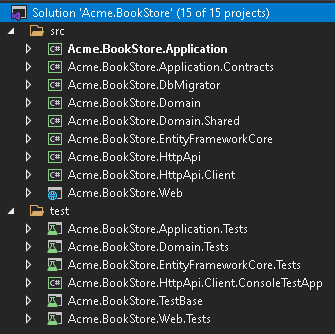

# 介绍


> 微服务盛行的当下，项目开始的时候总会对一个业务进行梳理拆分，但有时候就会纠结，某个服务要不要拆成一个服务？ 拆的太细，服务太多，维护起来麻烦。
>
> 揉着一起又觉得耦合太严重，项目结构不清晰，代码混乱。这个时候我们可以考虑下采用一种模块化的开发方案。


`Stark框架` 就是基于模块化的设计思想创造出来的，可以让我们实现一种`渐进式`的开发方式，纠结的时候可以把服务先创建为其中一个应用模块，后续有需要了再抽离成一个单独的服务进行部署。由于其中的Controller、Service、Model都单独再一起，所以抽离的时候这个过程就会很方便。


### 框架设计

```xml
Stark
├── framework
│   ├── Stark
│   ├── Stark.Starter.Cap
│   ├── Stark.Starter.Core
│   ├── Stark.Starter.DDD
│   ├── Stark.Starter.Job
│   ├── Stark.Starter.Redis
│   ├── Stark.Starter.Web
│   └── Stark.Starter.Work.Weixin
└── service
     ├── Modules
     │   ├── Stark.Module.AI
     │   ├── Stark.Module.Cms
     │   ├── Stark.Module.Inf
     │   ├── Stark.Module.System
     │   └── Stark.Module.Test
     └── Stark.Admin
```


`Stark框架` 是基于`Volo.Abp.Autofac`类库开发的，基于此实现了模块化的加载。ABP框架虽然大而全， 但使用起来总觉得有点“重”，所以我只取了核心的部分，创建了这个轻巧的框架。相比于ABP动辄创建好几个项目的方式，Stark则轻便了许多，虽减少了灵活性却更加容易理解和使用。 我觉得还是比较值得的。





## Starter和 Module

`Starter`其实也是个`Module`，但功能上有些许区别

- Starter属于框架模块，提供通用的基础架构功能

  了解java的Spring框架的同学可能知道，Spring框架就提供了很多Starter,这些Starter会自动加载相关依赖和配置，编写少量配置即可使用。 Stark的`Starter`包就类似于它。 让我们写一个新的项目或者想要那些通用的基础功能的时候。不需要再在Startup里面一遍遍的配置。只要加一个模块依赖，`Starter`会自动实现。

- Module属于应用程序模块，属于系统内的业务功能

  通用的业务功能也可以封装起来形成一个单独的模块，目前系统内提供了有`RBAC`的`系统管理模块`、包好文件上传的`基础模块`以及AI知识库的`AI模块`,如果没有特殊的要求，可以快速将这些业务模块集成到你的系统中。

